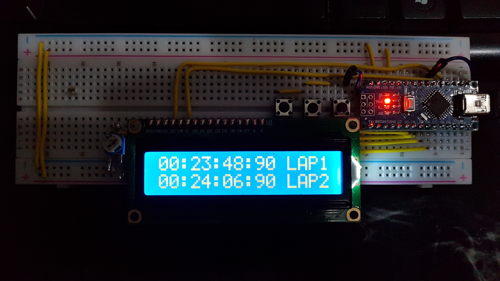

# Timer for runners  
Small customized AVR project. Includes LCD and some interrupted buttons.
Main goal was make timer for runners with lap detection and storage 3 laps for two different intervals. Finally I used 3 buttons and ADC converter to do it with one interrupt.
- Button0 - Start/stop/increment interval
- Button1 - Reset/Move list
- Button2 - Next screen  

## [YouTube video](https://youtu.be/JDiaDJhHkFk "Youtube video")

  
  

